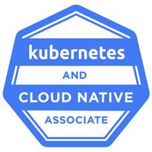
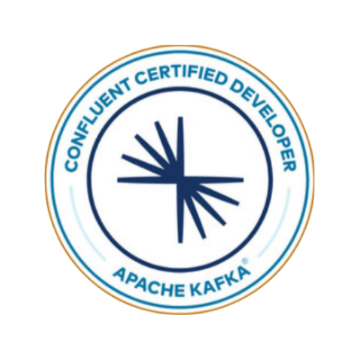

<h1 align="center">Hi 👋, I'm Roman Melnyk</h1>
<h3 align="center">A passionate Backend engineer with DevOPS and DataOPS experience</h3>

- 🔭 I’m currently working on vidiq.com [vidiq.com](vidiq.com)

- 📝 Sometimes I write articles on [Medium](https://medium.com/@aywengo)

- 💬 Ask me about **Kubernetes, Apache Kafka, AWS**

-  📫 How to reach me: [email](mailto:aywengo@gmail.com)

- 📄 Know about my experiences [cv.melnyk.co](cv.melnyk.co)

<h3 align="left">Connect with me:</h3>

<h3 align="left">Languages and Tools:</h3>

                 

<h3 align="left">Cetifications:</h3>

